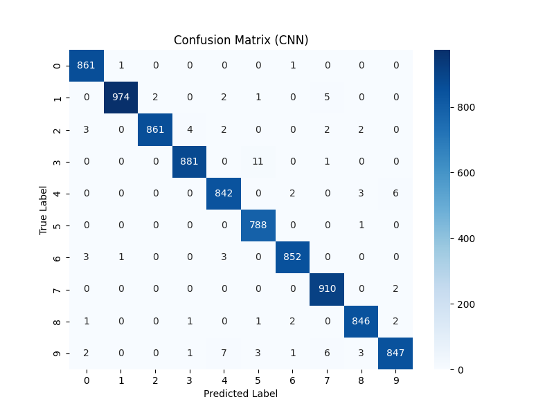

# MNIST Handwritten Digit Classifier

This project builds and compares multiple deep learning models for handwritten digit classification using the MNIST dataset.

The goal is to explore how architecture and regularization affect model performance.

---

## Models Implemented

• Multilayer Perceptron (MLP)

• MLP with Dropout Regularization

• Convolutional Neural Network (CNN)

---

## Dataset

MNIST dataset

70,000 grayscale images of handwritten digits (28x28 pixels).

---

## Training Pipeline

1. Load dataset
2. Train / Dev / Test split
3. Normalize images
4. Train multiple architectures
5. Evaluate performance

---

## Evaluation Metrics

Accuracy  
Confusion Matrix  
Precision / Recall / F1-score

---

## Best Model

CNN achieved the highest accuracy on the MNIST test dataset.

---

## Run the Streamlit App

Install dependencies

pip install -r requirements.txt

Run the app

streamlit run app.py

Upload an image of a handwritten digit and the model predicts the number.

---

## Technologies Used

Python  
TensorFlow / Keras  
NumPy  
Scikit-learn  
Matplotlib  
Streamlit

## Results

| Model | Test Accuracy |
|------|---------------|
| MLP | 97% |
| MLP + Dropout | 98% |
| CNN | 99% |

CNN achieved the best performance on the MNIST dataset.

## Model Performance

### Accuracy Curve

